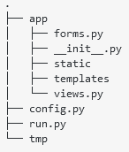
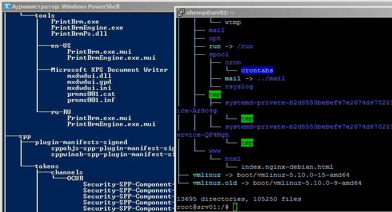
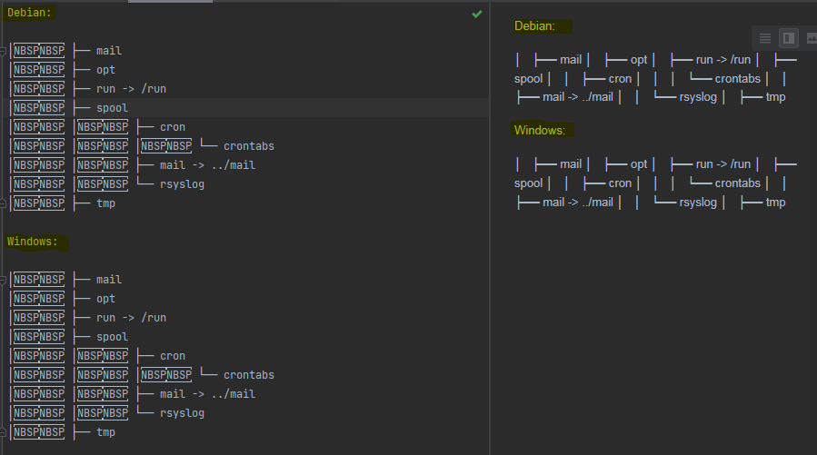
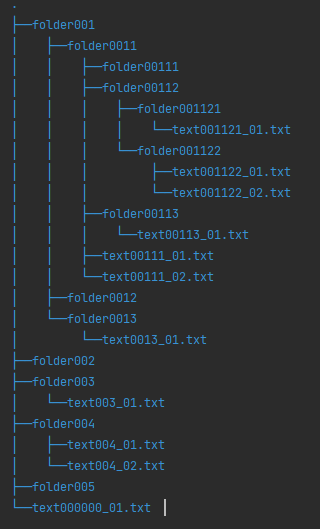
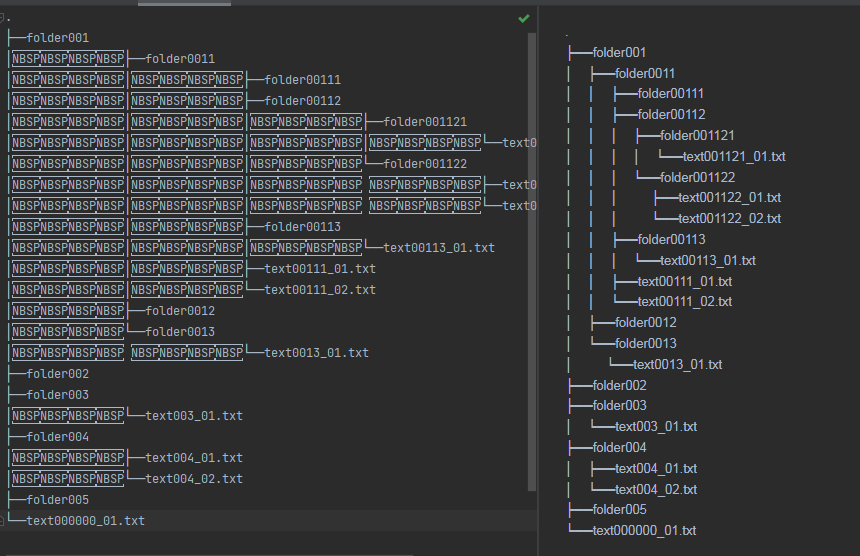

# tree_md #

## Введение в проблему ## 
Возникла проблема во время заполнения файла README.md. Необходимо было сформировать схему файловой структуры, наподобие этой:  
  

В Debian и в Windows (PowerShell), есть утилита `tree`, которая формирует подобную древовидную структуру:  
  
Но, при копировании в файл README.md, где используется язык разметки Markdown форматирование слетает, т.к. для перевода на новую строку нужно поставить два пробела, затем нажать ввод.
Кроме, того, не все файлы и директории нужны в построенном дереве.  
Можно, вручную расставить, в конце каждой строки пару пробелов и перевод каретки, но занятие неблагодарное, поэтому "до основания, а затем...".  
  

## Постановка задачи ##
Написать программу, которая:  
- [X] считывала из указанной директории все поддиректории.   
    - [X] Программа принимает введённую директорию и определяет её, как рабочую, относительно которой строится дерево. Если директория не указана, то рабочей директорией становится текущая папка.
    - [X] Программа, обходя все директории (BFS - поиск в ширину, не рекурсивный вариант), строит словарь следующего вида {'предок': ['потомок1', 'потомок2', ...]}
- [ ] считывала, кроме, тех файлов и директорий, что указаны в файле `.gitignore`  
- [X] формировала на выходе дерево файловой структуры
    - [X] Формирование дерева директорий.
    - [X] Формирование дерева директорий и файлов.
- [X] каждая строка дерева должна содержать "правильный" перевод на новую строку (два пробела, Enter)  
- [ ] для упрощения работы, создать интерфейс, используя Tkinter

## Основные возможности ##
Программа позволяет строить дерево файловой системы в формате, только директории, либо директории и файлы.
После, чего выведенный результат можно вставить в файл README.md, с сохранением форматирования. Использовался модуль
pathlib, т.к. он сочетает в себе лучшее из модулей файловой системы Python — `os`, `os.path`, `glob` и так далее.
В результате, удалось "пощупать" модуль pathlib, вспомнить, что такое графы. Считаю, что, тут есть ещё, что дорабатывать
в плане структуры словаря файловой системы, т.к. можно неприятно удивиться, если в построенном дереве файловой системы
будет две одинаковых по названию директории... В требуемой для меня задачи, это будет наврядли. 
Также испытал pdoc3 - инструмент для написания Python-документации.  

### Пример работы: ###  

  

 
## Установка ##

<li>Создаём виртуальное окружение с помощью venv, позволяющей создавать изолированные среды для отдельных проектов Python, решая тем самым проблему зависимостей и совместимости приложений разных версий. Ниже, env - это директория создаётся виртуальное окружение.

###### Для Windows:  ######
```
-m venv env   
env\Scripts\activate 
```
###### В Ubunty/Debian: ###### 

```shell
$ python3 -m venv env  

$ . env/bin/activate
```
</li>
<li>Устанавливаем модули из файла зависимостей:  

`pip install -r requirements.txt`</li> 

[Описание программы](./doc/html/sfs.md)

## Материалы ##

https://python-scripts.com/file-exists
https://habr.com/ru/post/504374/
https://pythobyte.com/python-pathlib-module-14-practical-examples-0164d8d7/


